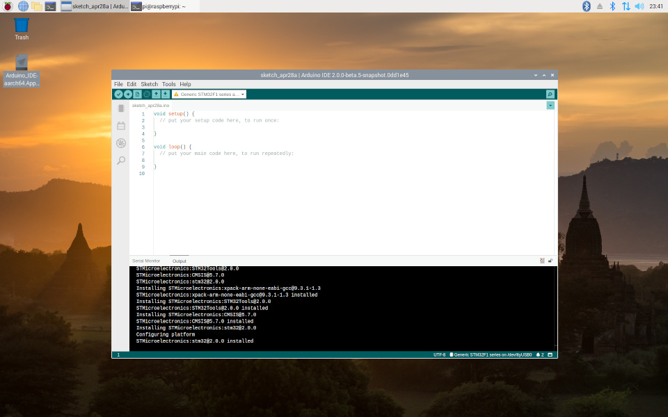

# arduino-ide 2.0.0 for Raspberry Pi

## Beta

[](https://github.com/koendv/arduino-ide-raspberrypi/raw/main/images/screenshot.png)

These are compilation notes for [arduino-ide 2](https://github.com/arduino/arduino-ide) on raspberry pi os 64-bit.

## Compiling the IDE

These are instructions on compiling arduino-ide from source.

Make sure ZIP_DIR points to the directory where you have downloaded the pre-built clangd and arduino-language-server binaries.

```
export ZIP_DIR=~/src/arduino-ide-builds
apt-get install libxkbfile-dev libsecret-1-dev
git clone https://github.com/arduino/arduino-ide
cd arduino-ide
export ARD_DIR=$PWD
cd $ARD_DIR/arduino-ide-extension/
mkdir build
cd build
unzip $ZIP_DIR/clangd-13.0.0_Linux_ARM64.zip
unzip $ZIP_DIR/arduino-language-server_Linux_ARM64.zip
cd $ARD_DIR
wget -qO- https://raw.githubusercontent.com/nvm-sh/nvm/v0.39.0/install.sh | bash
. ~/.config/nvm/nvm.sh
. ~/.config/nvm/bash_completion
nvm install 12.14.1
npm install --global yarn
npm install "filenamify@4.2.0" "react@16.14.0" "react-dom@16.14.0" "font-awesome@4.7.0" "request@2.88.2" "inversify@5.1.1" "vscode-textmate" "@octokit/core@>=3"
yarn install --frozen-lockfile
yarn
(cd electron-app; yarn theia rebuild:electron )
yarn --cwd ./electron/packager/
yarn --cwd ./electron/packager/ package
```

This creates the file ``$ARD_DIR/arduino-ide/electron/build/dist/arduino-ide_2.0.0-rc1-snapshot.767b09d_Linux_ARM64.zip ``

## appimage

To make deployment easier, create an appimage.
Download latest AppRun and appimagetool from [git](https://github.com/AppImage/AppImageKit/releases/tag/continuous)

```
mkdir -p arduino-ide-appdir/usr/bin arduino-ide-appdir/usr/lib
cd arduino-ide-appdir
export APP_ROOT=$PWD
cd $APP_ROOT/usr/bin
unzip $ARD_DIR/arduino-ide/electron/build/dist/arduino-ide_2.0.0-rc1-snapshot.767b09d_Linux_ARM64.zip 
cp *.so $APP_ROOT/usr/lib/
cd $APP_ROOT
cat >arduino-ide.desktop <<EOD
[Desktop Entry]
Type=Application
Version=1.0
Name=Arduino IDE
Icon=arduino-ide
Exec=arduino-ide %f
MimeType=text/x-arduino;
Categories=Development;Engineering;Electronics;
Keywords=embedded electronics;electronics;microcontroller;
X-AppImage-Version=2.0.0-rc1
EOD
wget -O arduino-ide.svg http://halley.cc/paste/arduino.svg
wget -O AppRun https://github.com/AppImage/AppImageKit/releases/download/continuous/AppRun-aarch64
chmod +x ./AppRun
```

At this point, you can test run the arduino-ide with: ```./AppRun```

Create the appimage. For aarch64, type:
```
cd  $APP_ROOT/..
wget https://github.com/AppImage/AppImageKit/releases/download/continuous/appimagetool-aarch64.AppImage
chmod +x ./appimagetool-aarch64.AppImage
ARCH=arm_aarch64 ./appimagetool-aarch64.AppImage ./arduino-ide-appdir
```
This creates the file ``Arduino_IDE-aarch64.AppImage``.

## clangd

The clangd binary from [releases](https://github.com/koendv/arduino-ide-raspberrypi/releases/) has been compiled like this:

```
git clone -b llvmorg-12.0.0 https://github.com/llvm/llvm-project
cd llvm-project
export LLVM_ROOT=$PWD
mkdir build
cd build
cmake $LLVM_ROOT/llvm/ -DCMAKE_BUILD_TYPE=Release -DLLVM_ENABLE_PROJECTS="clang;clang-tools-extra" -DLLVM_STATIC_LINK_CXX_STDLIB=ON -DLLVM_BUILD_STATIC=ON -G Ninja
cmake --build $LLVM_ROOT/build --target clangd
zip -r clangd-12.0.0_Linux_ARM64.zip ./bin/clangd ./lib/clang/
```

## arduino language server

The arduino-language-server binary from [releases](https://github.com/koendv/arduino-ide-raspberrypi/releases/) has been compiled like this:

```
export PATH=/usr/lib/go-1.14/bin:$PATH
git clone -b 2.0.0-beta.6 https://github.com/arduino/arduino-language-server
cd arduino-language-server
go version
# check go version 1.14
go build
zip arduino-language-server_Linux_ARM64.zip ./arduino-language-server
```

not truncated.
